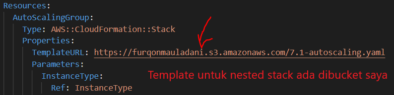

# CloudFormation Guide
_[DISCLAIMER] CloudFormation template yang dibuat ini diperuntukkan untuk pembelajaran. Jika ingin diterapkan didalam environment production diharuskan untuk ditest terlebih dahulu karena bisa saja terdapat error._

_[NOTICE]: Diharapkan ketika menggunakan template yang menggunakan Nested Stack seperti gambar berikut ini untuk mengganti lokasi bucket yang saya punya kalau terjadi error saat eksekusi template._

Langkah-langkahnya:
1. Download semua template yang ada di GitHub ini dan upload ke S3 bucket milik masing-masing.
2. Ubah URL ditemplate yang menggunakan nested stack yang sebelumnya menggunakan bucket saya dengan bucket milik masing-masing.

## Additional Material
Format template
https://docs.aws.amazon.com/AWSCloudFormation/latest/UserGuide/template-anatomy.html

Parameter
https://docs.aws.amazon.com/AWSCloudFormation/latest/UserGuide/parameters-section-structure.html

Ambil Parameter dari System Manager - Parameter Store atau Secret Manager
https://docs.aws.amazon.com/AWSCloudFormation/latest/UserGuide/dynamic-references.html

Mapping
https://docs.aws.amazon.com/AWSCloudFormation/latest/UserGuide/mappings-section-structure.html

Condition
https://docs.aws.amazon.com/AWSCloudFormation/latest/UserGuide/conditions-section-structure.html

Output
https://docs.aws.amazon.com/AWSCloudFormation/latest/UserGuide/outputs-section-structure.html

Import value dari output resource (misalkan import VPC-ID stack yang sudah jadi sebagai properties saat membuat Target Group milik Load Balancer)
https://docs.aws.amazon.com/AWSCloudFormation/latest/UserGuide/intrinsic-function-reference-importvalue.html

Join - Menggabungkan beberapa variable
https://docs.aws.amazon.com/AWSCloudFormation/latest/UserGuide/intrinsic-function-reference-join.html

Referensi template untuk masing-masing service
https://docs.aws.amazon.com/AWSCloudFormation/latest/UserGuide/aws-template-resource-type-ref.html
