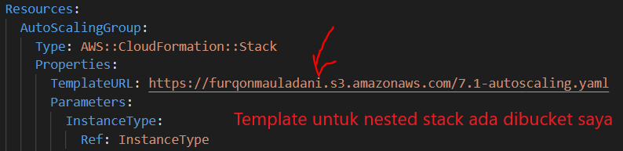

# ☁️ AWS CloudFormation Guide

Welcome! This repository is designed to help you master AWS CloudFormation through practical templates and modular structures.

> [!CAUTION]
> **DISCLAIMER:** The CloudFormation templates provided here are intended for **educational purposes**. If you plan to implement them in a production environment, ensure you test them thoroughly first, as configuration errors can occur.

> [!IMPORTANT]
> **NOTICE:** When using templates that involve **Nested Stacks** (as illustrated below), you **must** update the S3 bucket location. Failure to replace the default bucket URL with your own will result in execution errors. 
---

## 🚀 Getting Started

To successfully deploy these stacks, follow these steps:

1. **Download** all templates from this repository.
2. **Upload** them to your own private **Amazon S3 bucket**.
3. **Update the URLs** in the master/parent templates that reference nested stacks. Replace my bucket name with the name of the bucket you created in Step 2.

---

## 📚 Additional Resources & Documentation

Mastering CloudFormation requires understanding its specific syntax and functions. Use the official AWS documentation below as your roadmap:

### **Core Structure**

* **[Template Anatomy](https://docs.aws.amazon.com/AWSCloudFormation/latest/UserGuide/template-anatomy.html):** Learn the required and optional sections of a template.
* **[Parameters](https://docs.aws.amazon.com/AWSCloudFormation/latest/UserGuide/parameters-section-structure.html):** How to input custom values at runtime.
* **[Mappings](https://docs.aws.amazon.com/AWSCloudFormation/latest/UserGuide/mappings-section-structure.html):** Create lookup tables (e.g., Region-to-AMI maps).

### **Advanced Logic**

* **[Dynamic References](https://docs.aws.amazon.com/AWSCloudFormation/latest/UserGuide/dynamic-references.html):** Retrieve values from **SSM Parameter Store** or **Secrets Manager**.
* **[Conditions](https://docs.aws.amazon.com/AWSCloudFormation/latest/UserGuide/conditions-section-structure.html):** Control whether certain resources are created based on logic (e.g., `isProd`).
* **[Outputs](https://docs.aws.amazon.com/AWSCloudFormation/latest/UserGuide/outputs-section-structure.html):** Export information for use in other stacks or the console.

### **Intrinsic Functions**

* **[ImportValue](https://docs.aws.amazon.com/AWSCloudFormation/latest/UserGuide/intrinsic-function-reference-importvalue.html):** Share information between stacks (e.g., importing a VPC-ID from a networking stack into a Load Balancer stack).
* **[Join](https://docs.aws.amazon.com/AWSCloudFormation/latest/UserGuide/intrinsic-function-reference-join.html):** Combine multiple variables or strings into a single value.

### **Service Reference**

* **[Resource Type Reference](https://docs.aws.amazon.com/AWSCloudFormation/latest/UserGuide/aws-template-resource-type-ref.html):** The ultimate dictionary for configuring every AWS service via CloudFormation.
